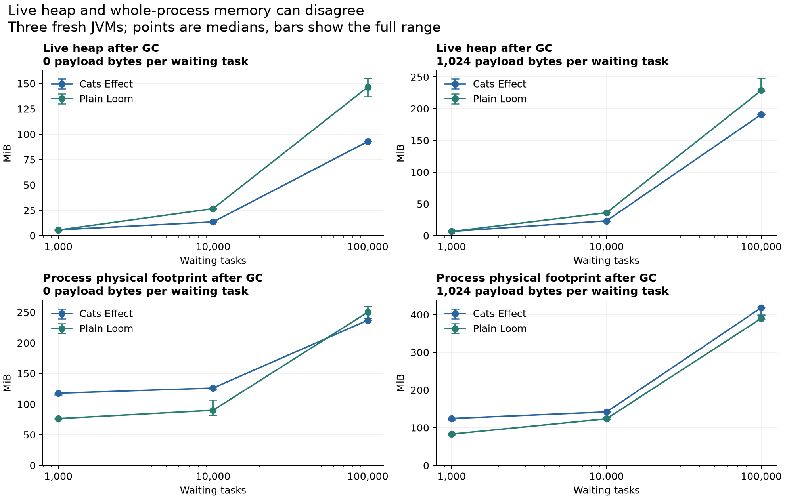
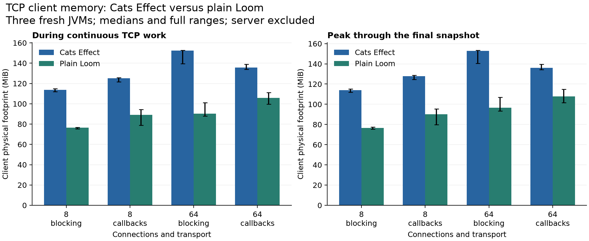

# CE versus Loom: what actually stays in memory?

Loom used less whole-process memory in every TCP case in this experiment. Cats Effect used less
live heap when holding 10,000 or 100,000 waiting tasks. Both statements describe the same completed
memory study; allocation rate alone would not have answered either question.

The study contains 60 fresh JVM measurements, three for each runtime/workload combination.
All cases passed verification. Values below are medians across those three JVMs, in MiB.
The [complete report](report.md) includes the full ranges and RSS measurements.

## Waiting tasks: heap and process totals give different answers

Each child starts, keeps its payload alive, waits for release, and is joined. CE uses fibers and
`Deferred`; plain Loom uses a virtual-thread executor and `CountDownLatch`. The test keeps one join
handle per child. Heap snapshots follow three full garbage collections while all children remain held.

| 100,000 waiting tasks | CE | Loom |
| --- | ---: | ---: |
| Live heap, zero payload bytes | 92.82 | 146.56 |
| Process footprint, zero payload bytes | 236.91 | 250.06 |
| Live heap, 1,024 payload bytes per child | 190.96 | 228.70 |
| Process footprint, 1,024 payload bytes per child | 418.45 | 389.99 |

With zero payload bytes, CE uses about 37% less live heap. Its median process footprint is only
about 5% smaller, and the process ranges overlap. Adding a 1 KiB payload keeps CE's live heap
about 17% smaller, while Loom's process footprint is about 7% smaller.

The difference starts before the large cohort exists. At 1,000 zero-payload tasks, total live heap
is nearly equal: CE 5.68 MiB and Loom 5.52 MiB. Process footprint is 117.78 versus 76.19 MiB.
The runtime and JVM overhead therefore matters at smaller task counts; multiplying one estimated
task size by concurrency would miss it.

Subtracting the warmed baseline at 100,000 zero-payload tasks gives about 923 bytes per CE child
versus 1,503 for the Loom construction. These include the wait primitive, task handle and empty
array header. They are not universal sizes for fibers or virtual threads: Loom's corresponding
estimate at 10,000 tasks is about 2,452 bytes. The experiment does not isolate the cause of that
change. Task count, compilation state, suspended call stacks and the chosen primitive all matter.

After release and GC, the 100,000 zero-payload cohorts fall to about 8.37 MiB of heap for CE and
4.35 MiB for Loom. Most of the held heap is reclaimed. The remaining difference from the warmed
baseline is not, by itself, evidence of a leak.

## TCP: Loom has the smaller process footprint here

This reuses the existing TCP construction: 256 exchanges per batch, persistent connections,
one outstanding exchange per connection, and a separate server requesting a 1 ms response delay.
After 32 warmup batches, the client runs continuously for five seconds while memory is sampled.
Only the client PID is measured; the server is excluded.

| Connections / transport | CE footprint | Loom footprint | Loom reduction |
| --- | ---: | ---: | ---: |
| 8 / blocking | 113.75 | 76.52 | 33% |
| 8 / callbacks | 125.10 | 89.14 | 29% |
| 64 / blocking | 152.49 | 90.32 | 41% |
| 64 / callbacks | 135.71 | 105.89 | 22% |

The full ranges across the three JVMs do not overlap between CE and Loom in these four cases.
At 64 blocking connections, peak process footprint is also lower: 152.92 MiB for CE versus
96.70 MiB for Loom. Peak includes startup, warmup, work and the explicit collections through
the final snapshot, rather than only the five-second active window.

The post-work heap is much smaller than either process total: roughly 5.1–5.5 MiB for CE and
3.7–3.9 MiB for Loom across the TCP cases. These snapshots are taken after the batch driver has
joined, with connections still open. They do not describe a batch suspended midway through I/O.

## What these numbers mean

Live heap approximates the Java objects still reachable after GC. Whole-process memory also
includes resident heap space beyond those objects, runtime code and metadata, native memory and
thread-related state. The JDK distinguishes occupied heap from committed capacity, and committed
address space is not interchangeable with resident physical memory.
[JDK memory usage](https://docs.oracle.com/en/java/javase/25/docs/api/java.management/java/lang/management/MemoryUsage.html).

The runner records macOS physical footprint and RSS separately through `proc_pid_rusage`. It never
adds them together. Raw current and peak counters are preserved; the reported peak is the maximum
of observed footprints and kernel peak readings. The first attempt stopped on an overly strict
counter-consistency check; all numbers here come from the complete fresh rerun.

Measurements used CE 3.7.1, Scala 3.8.4, JDK 25.0.3, G1, `-Xms64m -Xmx2g`, and runtime defaults
on the same M3 Max/macOS 26.7 machine as the earlier study. The initial heap is deliberately smaller
than the earlier performance suite's fixed 2 GiB heap. No allocation profiler or Native Memory
Tracking was enabled. Thirty-two report tests and sixteen memory-workload checks passed.

These are short, controlled constructions on one machine. They show that CE can hold many waiting
tasks in less live heap, while Loom can run this TCP client with a smaller process footprint.
Application payloads, deeper call stacks, a different GC/heap policy, or longer production workloads
need their own measurements.

[Full results](report.md), [method and reproduction](../../docs/memory.md),
[raw measurements](memory.json), [derived data](analysis.json), [provenance](metadata.json).
